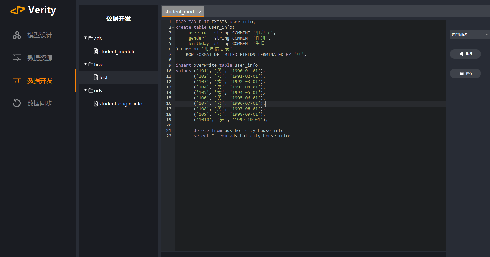

# Verity

Verity是一个使用javaFx开发的，集成了Hdfs、Hive、DataX等大数据框架及组件的集成开发平台。可以实现数仓从0到1的全流程搭建，具体包括对数仓模型的设计、Hql的开发与执行、异构数据源间的同步（目前仅支持Hive与Mysql间的数据同步），以及对数据资产的管理（目前仅支持Hdfs、Mysql）。使用Verity可以极大的减少数据开发者的工作量，使开发人员仅仅需要关注业务的实现，也无需掌握对Hdfs的操作、DataX脚本的具体编写等，降低开发者的开发难度。


---

### 快速开始

##### 环境准备

- Verity目前支持的各个框架的版本如下。

    - Mysql	5.1.27
	- Hadoop	3.1.3
	- Hive	3.1.3
	- DataX

- 其中，Mysql用于连接Mysql数据源以及Verity元数据的存储，为必须安装的；Hadoop与Hive用于连接Hdfs分布式文件系统和Hive数据源；DataX为数据同步工具，如需使用数据同步功能，则必须安装。

##### 软件安装

进入SetUp文件夹下，选择所需版本的安装包下载安装即可。（[点此下载](./SetUp/)）

##### 相关配置

- 首先，在Mysql数据库创建Verity的元数据库，执行安装目录中bin目录下的元数据库初始化脚本`VerityInit.sql`，即可完成元数据库的创建。

- 创建一个用于管理Verity元数据库的Mysql账户，并赋予权限：

    ```sql
    CREATE USER 'verity'@'%' IDENTIFIED BY 'Verity';
    GRANT ALL PRIVILEGES ON Verity.* TO 'verity'@'%';
    ```

- 配置安装目录中conf目录下的`config.properties`文件，配置说明如下

    | key                            | value                                                        | 配置示例                                                     |
    | ------------------------------ | ------------------------------------------------------------ | ------------------------------------------------------------ |
    | metastore.jdbc.datasource.size | 连接元数据库的连接数，默认10（不能为空）                     | 10                                                           |
    | metastore.jdbc.driver.name     | 连接元数据库的驱动程序类名（不能为空）                       | com.mysql.jdbc.Driver                                        |
    | metastore.jdbc.url             | 连接元数据库的url地址（不能为空）                            | jdbc:mysql://192.168.10.102:3306?useSSL=false&useUnicode=true&characterEncoding=utf8 |
    | metastore.jdbc.user            | 用于操作元数据库的数据库账户（不能为空）                     | verity                                                       |
    | metastore.jdbc.password        | 用于操作元数据库的数据库账户密码（不能为空）                 | 123456（推荐使用强密码）                                     |
    |                                |                                                              |                                                              |
    | mysql.jdbc.datasource.size     | 连接Mysql数据源的连接数，默认10                              | 10                                                           |
    | mysql.jdbc.driver.name         | 连接Mysql数据源的驱动程序类名                                | com.mysql.jdbc.Driver                                        |
    | mysql.jdbc.url                 | 连接Mysql数据源的url地址                                     | jdbc:mysql://192.168.10.102:3306?useSSL=false&useUnicode=true&characterEncoding=utf8 |
    | mysql.jdbc.user                | 连接Mysql数据源的数据库账户                                  | user                                                         |
    | mysql.jdbc.password            | 连接Mysql数据源的数据库账户密码                              | 123456（推荐使用强密码）                                     |
    |                                |                                                              |                                                              |
    | hdfs.url                       | 连接Hdfs分布式文件系统的url(如果需要连接Hive数据源，则此项必须配置) | hdfs://192.168.10.102:8020                                   |
    | hdfs.user                      | 连接Hdfs分布式文件系统的用户                                 | user                                                         |
    |                                |                                                              |                                                              |
    | hive.jdbc.datasource.size      | 连接Hive数据源的连接数，默认10                               | 10                                                           |
    | hive.jdbc.driver.name          | 连接Hive数据源的驱动程序类名                                 | org.apache.hive.jdbc.HiveDriver                              |
    | hive.jdbc.url                  | 连接Hive数据源的url地址                                      | jdbc:hive2://192.168.10.102:10000                            |
    | hive.jdbc.user                 | 连接Hive数据源的数据库账户                                   | user                                                         |
    | hive.jdbc.password             | 连接Hive数据源的数据库账户密码                               | 123456（推荐使用强密码）                                     |
    |                                |                                                              |                                                              |
    | remote.ssh.host                | 安装DataX的主机地址                                          | 192.168.10.102                                               |
    | remote.ssh.user                | 登录主机的用户名                                             | user                                                         |
    | remote.ssh.passwd              | 登录主机的用户名密码                                         | 23456（推荐使用强密码）                                      |
    | remote.ssh.port                | 连接主机的ssh端口                                            | 22                                                           |
    | datax.home.path                | DataX安装路径                                                | /home/user/datax                                             |

    

---

### 功能介绍

##### 用户注册登录

该功能主要用于多人协作开发，直接注册登录即可。

##### 项目管理

- 进入系统后是项目管理界面，此处展示了所有的项目，可以在这里进行创建项目、编辑项目、删除项目的操作，也可选择进入你拥有权限的项目进行具体的开发。

    

- 项目权限

    - 项目权限是指项目创建者管理的拥有开发该项目资质的人员列表

    - 在新建或编辑项目时可对该项目的权限进行管理，直接选择允许操作该项目的用户即可

        

##### 模型设计

- 该模块主要用于数仓模型的设计，目录层级可以按照数仓分层进行规划

- 生成ddl：可以直接将模型转换成DDL语句，可根据需要进行具体修改，然后复制到数据开发界面直接运行

- 一键导入/导出：可直接将外部的excel文件导入自动生成模型信息，也可将已经创建的模型信息导出成excel文件（后续待开发）

    

- 血缘关系：可帮助开发者理清数仓层之间各个表之间关系

    

##### 数据资源

- 该模块主要用于数据资产的查看，可对Mysql、Hive、HDFS资源进行可视化查看

- 删除、编辑、添加数据资源（后续待开发）

    

- Mysql/Hive资源

    - 左侧展示了所有的库，右侧展示了对应库下拥有的表，支持对表名进行搜索。
    - 选择要查看的表后，即可看到表相关的信息，包括表结构、表注释、表的数据预览等。

    

- HDFS资源

    - 可对HDFS文件系统进行可视化操作
    - 支持文件（夹）上传下载、新建文件夹、删除文件（夹），也可对HDFS文件路径直接编辑进行跳转

    

##### 数据开发

- 该模块主要用于具体的数仓开发，支持语法为Hql。

- 右侧选择需要执行查询的数据库，选中需要执行的查询语句后点击执行即可。

    

##### 数据同步

- 该模块主要用于不同数据源之间的数据同步，底层工具使用DataX

- 一般步骤：

    1. 添加映射，选择需要同步数据的数据源字段
    2. 给每个来源字段选择对应的目标字段
    3. 保存并预览将要执行的DataX脚本，可根据需要进行脚本的修改
    4. 点击执行，即可完成不同数据源之间的数据同步
    5. 查看同步作业运行日志，确认是否存在错误信息

- 自动匹配同名字段：该功能会自动检查数据源表和目标数据表之间是否存在相同命名的字段，如果有，则自动匹配

    

- 运行前检查：检查自动生成的DataX脚本是否需要根据实际开发情况修改

    - 文件类型`fileType`
    - 编码`encoding`
    - 字段分隔符`fieldDelimiter`
    - 运行配置`setting`

    

### 联系方式

如果您有任何建议，或者想要加入Verity的开发，欢迎联系我

邮箱：thechen.orange@gmail.com

### 另外

该系统是我在大学即将结束的阶段开发的，是对我大学四年以及对我所学专业的理解，开发中存在很多的漏洞，仍然需要不断的学习以及借鉴前辈们的经验。
